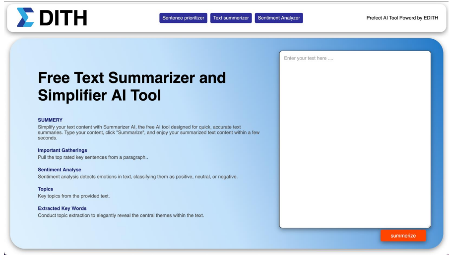

# Text Summarization Tool

This project's main goal is to create an automated, user-friendly system for text analysis and
summarization. The system is intended to

• Condense lengthy texts into brief summaries.

• Use sentiment analysis to determine the text's emotional tone.

• Extract essential sentences that encapsulate the text's major ideas.

• Model subjects to identify themes or subjects in the content by utilizing text corpora.

